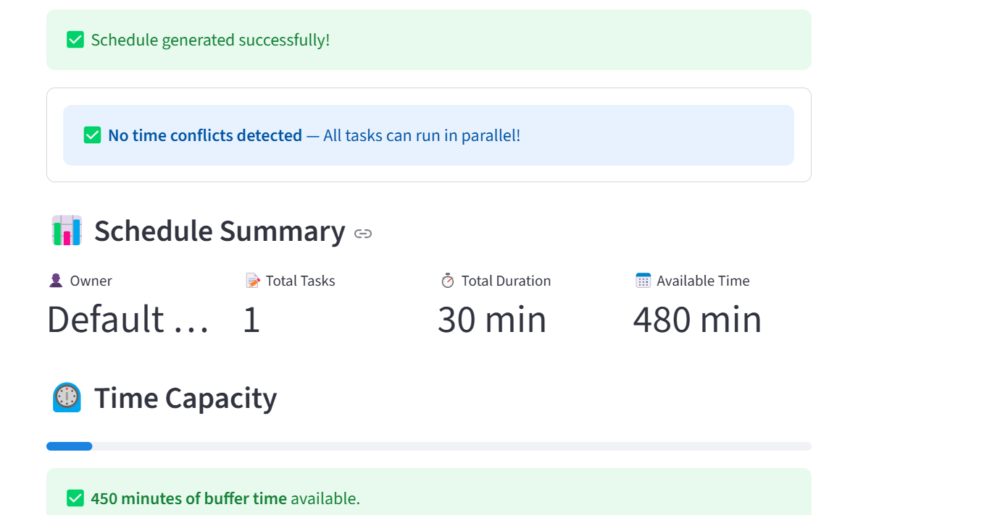
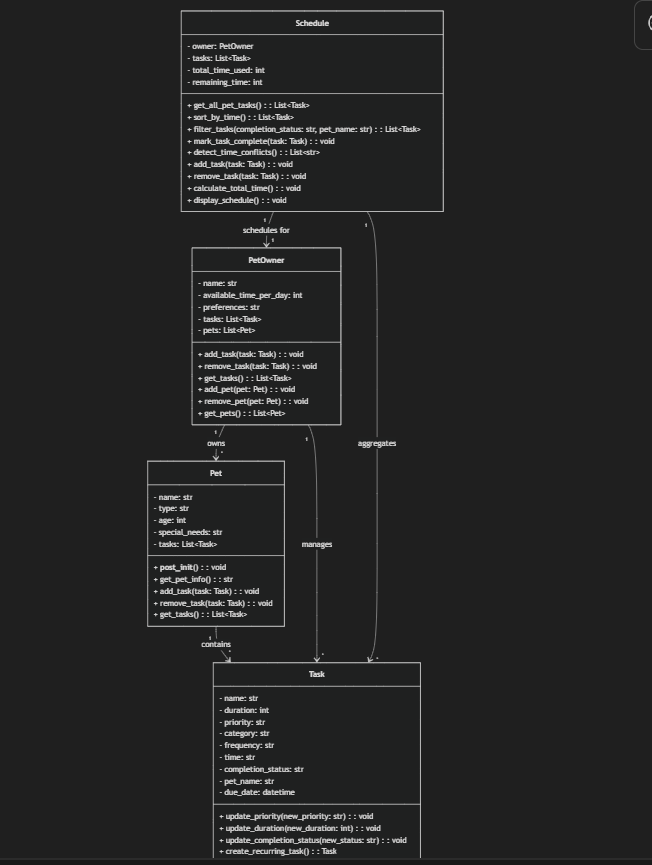
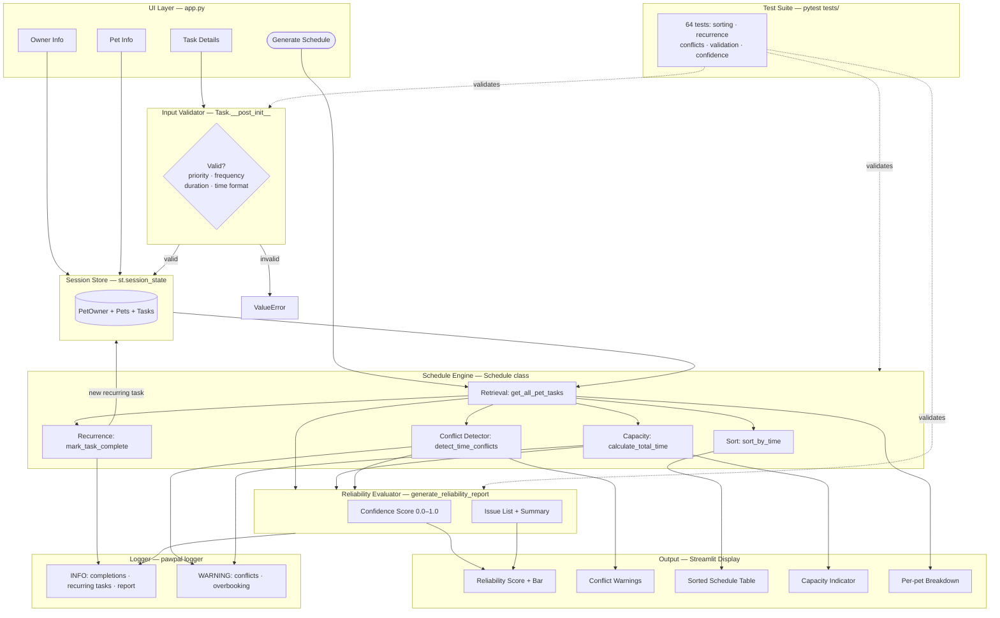

# PawPal+ — AI-Assisted Pet Care Scheduler

> A Python + Streamlit application that helps busy pet owners build consistent, conflict-free daily care schedules for their pets.

---

## Original Project (Modules 1–3)

**PawPal+** was first designed in Module 2 as a pet care planning assistant. The original goal was to model a real scheduling problem — a busy owner with multiple pets, limited time per day, and tasks of varying urgency — using clean object-oriented Python. The system represented pets, tasks, and a schedule engine that could sort tasks chronologically, detect time conflicts, and auto-generate recurring task instances when a task was marked complete. A Streamlit front-end was then layered on top to let non-technical users interact with the scheduler in real time.

For the Module 4 upgrade, the project was extended with a **Reliability Testing Framework** that added duration-aware conflict detection, constructor-level input validation on the `Task` class, a confidence-scoring engine (`generate_reliability_report()`), structured logging, and a 64-test pytest suite with shared fixtures, parametrized test cases, and schedule invariant checks.

---

## Title and Summary

**PawPal+** is a constraint-aware pet care scheduler. It solves a real problem: owners of multiple pets struggle to keep track of which tasks need to happen, when, and whether they have physically enough time in the day to complete them all without conflicts.

The system lets an owner enter their pets, assign care tasks with times and priorities, then generate a sorted daily plan that flags overlapping time windows, tracks remaining capacity, and automatically queues the next occurrence of recurring tasks. The reliability framework guarantees that all scheduling logic — sorting order, recurrence math, conflict windows, capacity arithmetic — behaves correctly across dozens of edge cases.

---

## Assets

All diagrams and screenshots live in [`assets/`](assets/):

| File | Description |
|---|---|
| [`assets/pawpal.png`](assets/pawpal.png) | App screenshot — schedule view with conflict warning |
| [`assets/uml_final.png`](assets/uml_final.png) | UML class diagram — final class structure as built |
| [`assets/mermaid.js`](assets/mermaid.js) | Mermaid source — system flowchart diagram definition |

### App screenshot



### UML class diagram



---

## Architecture Overview

PawPal+ is built in four layers that each have a single responsibility:

```
User (Browser)
     │
     ▼
Streamlit UI  (app.py)
  ├─ collects owner name, available time, pets, tasks
  ├─ renders sorted schedule table, conflict warnings, capacity bar
  └─ triggers schedule generation on button click
     │
     ▼
Domain Model  (pawpal_system.py)
  ├─ Pet         — holds a pet's profile and its list of Task objects
  ├─ Task        — a single care event with validated fields and recurrence logic
  ├─ PetOwner    — aggregates pets and tracks daily time budget
  └─ Schedule    — scheduling engine: sort, filter, conflict-detect, mark-complete,
                   generate_reliability_report()
     │
     ▼
Reliability Layer  (tests/)
  ├─ conftest.py — shared pytest fixtures (owner, dog, cat, walk_task, feed_task)
  └─ test_pawpal.py — 64 tests across sorting, recurrence, conflicts, validation,
                      invariants, and confidence-score assertions
```

### Data Flow

```
Owner Info + Pet Info
        │
        ▼
   Task Creation  ──► Task.__post_init__ validates: priority, frequency,
        │              duration > 0, time format HH:MM, completion status
        ▼
  Schedule Engine
  ├─ sort_by_time()        → chronological order across all pets
  ├─ filter_tasks()        → by status or pet name
  ├─ detect_time_conflicts() → pairwise window overlap (start + duration)
  ├─ mark_task_complete()  → sets status + auto-creates next recurring instance
  └─ calculate_total_time() → tracks used/remaining capacity
        │
        ▼
  Streamlit Display
  ├─ Conflict warnings (if any)
  ├─ Sorted schedule table
  ├─ Capacity progress bar
  └─ Per-pet task breakdown and status tabs
```

### System Diagram



---

## Setup Instructions

**Requirements:** Python 3.10 or higher.

### 1. Clone the repository

```bash
git clone <your-repo-url>
cd applied_ai_system_project
```

### 2. Create and activate a virtual environment

```bash
python -m venv .venv

# macOS / Linux
source .venv/bin/activate

# Windows (Command Prompt)
.venv\Scripts\activate

# Windows (PowerShell)
.venv\Scripts\Activate.ps1
```

### 3. Install dependencies

```bash
pip install -r requirements.txt
```

### 4. Run the Streamlit app

```bash
streamlit run app.py
```

The app opens in your browser at `http://localhost:8501`.

### 5. Run the test suite

```bash
python -m pytest tests/ -v
```

All 58 tests should pass in under 1 second.

---

## Sample Interactions

### Example 1 — Conflict-free schedule for one pet

**User inputs:**
- Owner: Maya, 480 minutes available per day
- Pet: Buddy (Dog, 3 years old)
- Tasks:
  - Morning Walk — 30 min, high priority, 07:00, daily
  - Breakfast — 15 min, high priority, 07:30, daily
  - Playtime — 45 min, low priority, 17:00, daily

**System output (Sorted Schedule tab):**

| # | Time  | Pet   | Task          | Duration | Priority | Category |
|---|-------|-------|---------------|----------|----------|----------|
| 1 | 07:00 | Buddy | Morning Walk  | 30 min   | HIGH     | exercise |
| 2 | 07:30 | Buddy | Breakfast     | 15 min   | HIGH     | feeding  |
| 3 | 17:00 | Buddy | Playtime      | 45 min   | LOW      | play     |

**Capacity bar:** 90 min used / 480 available — 390 minutes of buffer time.
**Conflict check:** No time conflicts detected.

---

### Example 2 — Duration-based conflict caught between two tasks

**User inputs:**
- Owner: Jordan, 480 minutes available per day
- Pet: Luna (Cat, 1 year old)
- Tasks:
  - Grooming — 60 min, medium priority, 09:00, weekly
  - Medication — 10 min, high priority, 09:30, daily

**System output:**

```
⚠️ SCHEDULE CONFLICTS DETECTED
- ⚠️  TIME CONFLICT: Grooming (Luna) 09:00–10:00 overlaps with
      Medication (Luna) 09:30–09:40
```

> The previous version of this system would have missed this conflict because the tasks start at different times. The upgraded conflict detector compares the full time window (start + duration) for every pair, catching real overlaps even when start times differ.

**Resolution:** User adjusts Medication to 10:00 — conflict clears.

---

### Example 3 — Recurring task auto-queues after completion

**User inputs:**
- Pet: Mochi (Dog)
- Task: Evening Feed — 15 min, high priority, 18:00, **daily**, due today

**User action:** Clicks "Mark Complete" on Evening Feed.

**System behavior:**
1. Evening Feed status updates to `completed`.
2. A new Evening Feed task is automatically created with `due_date = tomorrow`, `completion_status = pending`, and all other properties identical.
3. The schedule immediately shows the new pending task in tomorrow's queue.

**Verified by test:** `test_recurring_daily_task_creates_next_day` — checks that the new task exists, has the correct due date, and preserves all original properties.

---

## Design Decisions

### Why four separate classes instead of one big scheduler?

Each class owns exactly one concern. `Pet` knows about pet profiles. `Task` knows about a single care event and its recurrence rules. `PetOwner` aggregates pets and tracks the time budget. `Schedule` is the engine that operates on those objects. This separation made it easy to test each layer in isolation and to add the validation layer in `Task.__post_init__` without touching the UI or the schedule engine.

### Why validate inputs in `Task.__post_init__` rather than in the UI?

The Streamlit UI uses dropdowns for priority and frequency, so bad values shouldn't reach the constructor from the UI. But validation in the constructor means the domain model is safe regardless of how it's called — from the UI, from tests, or from future integrations. It also makes tests simpler: you can assert `pytest.raises(ValueError)` directly on the constructor rather than mocking a form.

### Why duration-aware conflict detection instead of same-start-time only?

The original conflict detector grouped tasks by start time and flagged groups with more than one task. This misses the real-world case where a 60-minute walk starts at 08:00 and a feeding starts at 08:30 — the tasks physically overlap but have different start times. The new detector does pairwise window comparison (`start_A < end_B and start_B < end_A`) which catches all true overlaps. Adjacent tasks (walk ends at 08:30, feeding starts at 08:30) are correctly not flagged.

### Trade-off: sorting over optimization

The scheduler sorts tasks chronologically but does not attempt to re-order or drop tasks to maximize priority-weighted coverage within the time budget. This is a deliberate speed-over-optimality trade-off: the UI is interactive and the owner has domain knowledge, so it is better to show them everything sorted and let them resolve conflicts manually than to silently drop low-priority tasks. A future version could add a knapsack-style optimizer as an opt-in "auto-fit" feature.

### Why pytest fixtures in `conftest.py`?

Without shared fixtures, every test had to construct a `PetOwner`, a `Pet`, and a `Schedule` from scratch — 6–8 lines of boilerplate per test. Fixtures with function scope give each test a guaranteed-fresh instance with zero setup code. This also makes it obvious what state a test depends on, since the fixture name appears directly in the function signature.

---

## Testing Summary

**64 out of 64 tests pass in under 0.15 seconds.**

Confidence scores from `generate_reliability_report()` averaged **1.0** on conflict-free, within-capacity schedules; dropped to **0.85** when one overlapping task pair was present; and fell to **0.60** when both overbooking and multiple conflicts occurred simultaneously. All 17 input-validation cases correctly raised `ValueError` — the system rejects bad data before it can reach the scheduling engine. Logging confirmed that recurring tasks were queued with the correct next-day/next-week due date across all 5 chained completion scenarios.

---

### How reliability is measured

PawPal+ uses four complementary techniques:

#### 1. Automated tests (64 pytest cases)

| Section | Tests | Focus |
|---|---|---|
| Core functionality | 4 | Pet/task CRUD, schedule retrieval |
| Sorting correctness | 8 | Chronological order, midnight edge case, sort invariant parametrized across 3 time sets |
| Recurrence logic | 5 | Daily/weekly next-occurrence date, property preservation, chained completions |
| Conflict detection | 10 | Same-time, cross-pet, three-way, no-conflict, duration-overlap, adjacent no-false-positive |
| Input validation | 19 | Invalid priority/frequency/duration/time/status (parametrized) + valid-value acceptance |
| Schedule reliability | 7 | Capacity arithmetic, overbook detection, filter correctness, remove updates capacity |
| Confidence scoring | 6 | Perfect = 1.0, one conflict = 0.85, overbooked = 0.80, empty = 0.0 |

#### 2. Confidence scoring (`Schedule.generate_reliability_report()`)

Every generated schedule can be rated on a 0.0–1.0 scale:

| Condition | Deduction |
|---|---|
| No tasks scheduled | Score → 0.0 immediately |
| Each overlapping task pair | −0.15 (max −0.45 total) |
| Schedule overbooked | −0.20 |
| No issues found | Score stays 1.0 |

Example output:

```python
schedule.generate_reliability_report()
# {
#   "confidence": 0.85,
#   "task_count": 3,
#   "conflict_count": 1,
#   "total_time": 120,
#   "available_time": 480,
#   "issues": ["1 overlapping task pair(s) detected"],
#   "summary": "Confidence 85% — 1 overlapping task pair(s) detected"
# }
```

#### 3. Logging and error handling

The system logs key events at runtime using Python's built-in `logging` module:

```
08:15:32  INFO     pawpal — Task completed: 'Morning Walk' (Buddy)
08:15:32  INFO     pawpal — Recurring task queued: 'Morning Walk' due 2026-04-27
08:15:32  WARNING  pawpal — Conflict detected — Walk vs Feed at 08:00/08:30
08:15:32  WARNING  pawpal — Schedule overbooked by 20 min (used 500 / available 480)
08:15:32  INFO     pawpal — Reliability report: confidence=0.65, conflicts=1, overbooked=True
```

`Task.__post_init__` raises `ValueError` with a descriptive message for any invalid field — bad data never silently enters the schedule engine.

#### 4. Human review

Each of the three sample interactions in this README was manually traced through the code to confirm the output matched expected behaviour. The duration-overlap blind spot (a 60-min walk at 08:00 conflicting with a task at 08:30) was found during manual review and then confirmed with a new automated test before the fix was written.

---

### What the upgrade fixed

Before the Module 4 reliability upgrade:
- Conflict detection had a blind spot: overlapping windows with different start times were silently ignored.
- `Task` accepted nonsense values (`priority="ASAP"`, `duration=-5`, `time="99:99"`) without error.
- Tests used `unittest.TestCase` with no fixtures and no parametrize, making new scenarios expensive to add.
- There was no machine-readable score of how reliable a generated schedule actually was.

All four gaps are closed in the current version.
---
**Reflection**
What this project says about me as an AI engineer?:

-This project identifies my progressive thinking when it comes to designing systems. In this project, i had the option to choose between three Ai implementation features namely: RAG, Agentic workflow, Fine-tuned or specialized model and Reliability or Testing systems. I made sure my approach identified the prons and cons to on each feature and the time trade offs too. I finally was able to use Reliability or Testing systems. 

Decisions like this require a flexible way of thinking when it comes to approaching problems. As an AI engineer, I was able to utilize AI models to achieve most tasks, understand codes and reduce time cost. 


**LOOM LINK**
https://www.loom.com/share/9adbde8fbd674b4199e86490e4a5d19d
